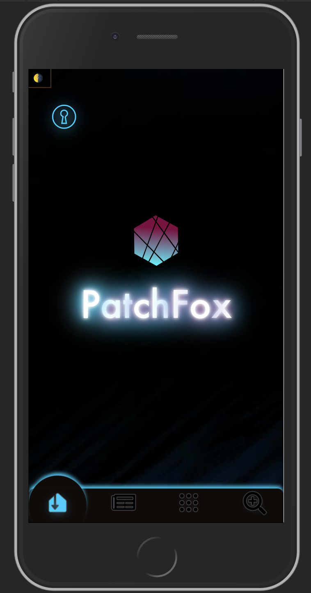
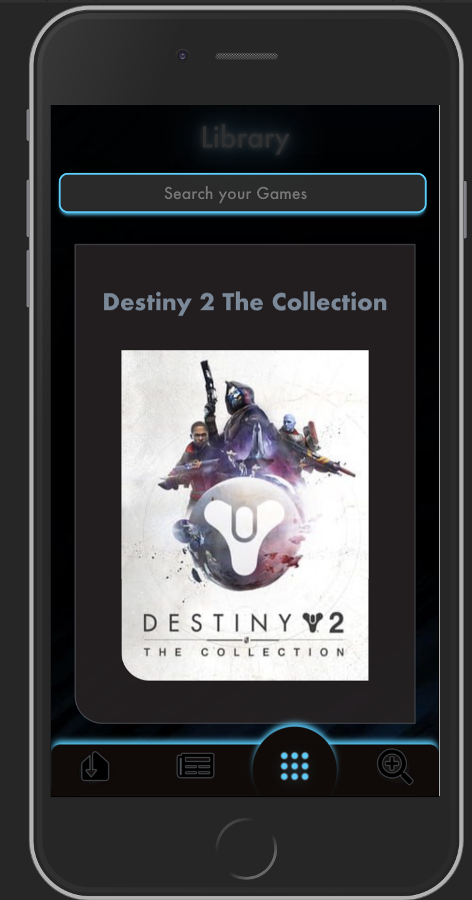

# PatchFox 

neuefische Gesellenstück: PatchFox: An App to browse for all kind of videogames, no matter which platform. Add them to your library and get all the informations you need!

 

This project was bootstrapped with [Create React App](https://github.com/facebook/create-react-app).

## Usage

To run PatchFox, clone the repository and install the client and server dependencies:

```
npm install
cd client
npm install
```

Start PatchFox:

```
npm run json

```

and

```
cd client
npm start
```
